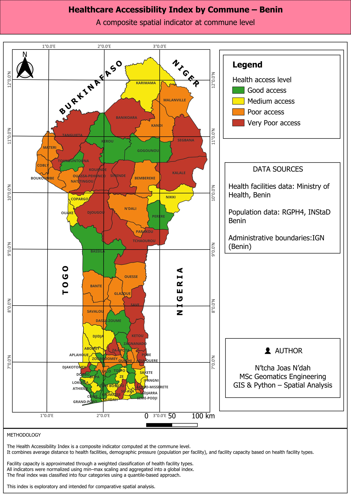
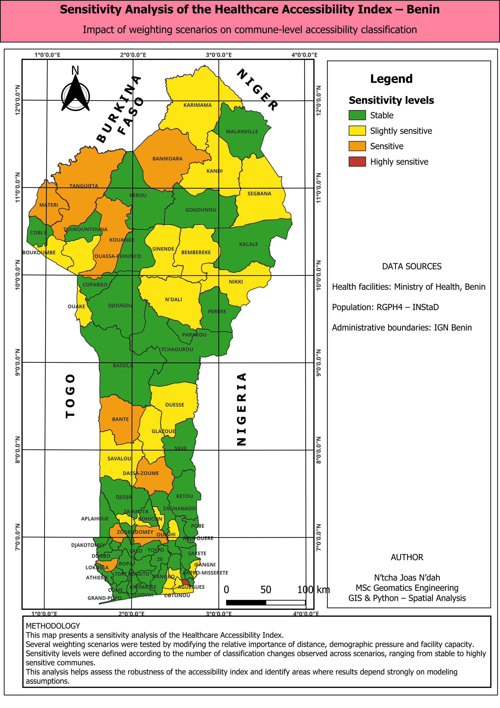

## Healthcare Accessibility in Benin 🇧🇯

Commune-level spatial analysis of healthcare accessibility using GIS and Python

This project analyzes healthcare accessibility across the 77 communes of Benin using a composite spatial index integrating:

Distance to health facilities

Demographic pressure

Facility capacity (weighted by type)

It also explores urban–rural disparities and tests the robustness of results through sensitivity analysis.

🚀 Update – Fully Reproducible GeoPandas Workflow (v2)

The analysis has been upgraded to a fully spatially reproducible pipeline using GeoPandas.

Instead of relying on intermediate CSV files, the index is now computed directly from:

Administrative boundaries (communes)

Localities (settlements)

Health facility point layers

Using:

Spatial joins (sjoin)

Nearest distance computation (sjoin_nearest)

Automated aggregation at commune level

This improves:

Reproducibility

Automation

Methodological transparency

Analytical robustness

## 🎯 Objectives

Measure healthcare accessibility at the commune level

Identify spatial inequalities across Benin

Test whether urban status guarantees better access

Assess the sensitivity of results to modeling assumptions

## 🧠 Key Findings

Urban status does not guarantee good healthcare access

Major urban communes (Cotonou, Abomey-Calavi, Porto-Novo, Parakou) are classified between medium and very poor access

Some rural communes show moderate accessibility due to lower demographic pressure

Accessibility patterns remain generally stable, but specific communes are sensitive to weighting choices

## 🗺️ Method Overview
Indicators

Mean distance from localities to nearest health facility

Population pressure (population / number of facilities)

Facility capacity proxy (weighted by facility type)

Processing Steps

Reprojection to metric CRS

Nearest distance computation (GeoPandas sjoin_nearest)

Spatial aggregation at commune level

Indicator normalization (min–max scaling)

Composite index construction

Quantile-based classification (4 classes)

Sensitivity scenario testing

## 📄 Full methodology available in methodology.md

## 📊 Outputs

Commune-level Healthcare Accessibility Index (Scenario A)

Sensitivity analysis scenarios (A–D)

Urban vs Rural statistical comparison

Stability classification

All outputs are available in:

-/data/processed/
-/outputs/tables/
-/outputs/maps/
---

## Maps (PDF)
- Health Accessibility Index map: `outputs/maps/health_access_map.pdf`
- Sensitivity analysis map: `outputs/maps/sensitivity_map.pdf`
- Urban–Rural comparison map: `outputs/maps/urban_rural_map.pdf`

## Quick preview

## 🛠️ Tools & Technologies
Python (pandas, geopandas)
GeoPandas spatial joins & nearest analysis
QGIS (cartography & layout design)
Reproducible spatial workflow

---

## 📌 Data Sources
- Health facilities: **Ministry of Health, Benin**
- Population data: **RGPH4 – INStaD**
- Administrative boundaries: **IGN Benin**

---

📁 Project Structure
/scripts_v1/                 # Initial workflow (CSV-based)
/scripts_v2_geopandas/       # Fully spatial GeoPandas workflow
    utils_indicators.py
    01_compute_index_geopandas.py
    02_sensitivity_analysis_geopandas.py
    03_urban_rural_analysis_geopandas.py

/data/raw/
/data/processed/
/outputs/maps/
/outputs/tables/

-------

## 👤 Author
**N’tcha Joas N’dah**  
MSc Geomatics Engineering  
GIS & Python – Spatial Analysis  
2026

---

